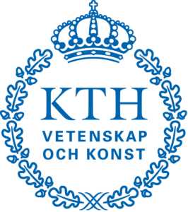
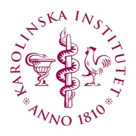

#  Employments

***

<!-- 
 -->

**Scientific Coordinator** for the Human Developmental Cell Atlas (HDCA)
01/02/2021 – current  
Science for Life Laboratory (SciLifeLab)
Department of Gene Technology, Royal Institute of Technology (KTH), Stockholm, Sweden

*Human developmental cell atlas (HDCA) is the Swedish effort within the human cell atlas (HCA), one of the largest international scientific projects. The project aim is to create a comprehensive molecular atlas of human prenatal development at the molecular resolution using state-of-the-art technologies such as single-cell RNA-seq, Spatial Transcriptomics, in situ sequencing in order to provide deeper insight into how variations and deviations contribute to health and disease. My role is to organize and foster connections across collaborators and technologies into joint efforts for the creation and divulgation of the atlas. My final aim is to create a comprehensive molecular atlas of human prenatal development at the molecular resolution using state-of-the-art technologies such as single-cell RNA-seq, Spatial Transcriptomics, in situ sequencing in order to provide deeper insight into how variations and deviations contribute to health and disease.*

***

<!-- 
 -->

**Senior Bioinformatician** – single-cell omics  
01/09/2018 – current  
National Bioinformatics Infrastructure Sweden (NBIS)
Science for Life Laboratory (SciLifeLab)
Department of Biochemistry and Biophysics (DBB), Stockholm University, Stockholm, Sweden

*NBIS is the SciLifeLab distributed national bioinformatics infrastructure, supporting life sciences in Sweden and is the Swedish node in ELIXIR - the European infrastructure for biological information. NBIS enables world-class life science by providing expert knowledge, creative data integration, advanced training, access to high-performance data and analysis methods. In this role, I offer bioinformatics guidance and services to researchers across Sweden. My current focus involves multi-omics analysis methods in Single Cell field, such as RNA sequencing, TCR repertoir analysis, in situ sequencing (image analysis) and flow cytometry. I am also engaged in advanced data analysis training in Single Cell at the European level through ELIXIR.*

***

**Postdoctoral researcher** – bioinformatician / computational biologist  
01/04/2015 – 31/08/2018  
Department of Medicine Solna, Karolinska Sjukhuset and Karolinska Institutet, Sweden

*Karolinska Institutet (KI) is the biggest medical university in Europe, as well as the biggest center for medical education and research in Sweden. KI aims to improve the development of knowledge about human life and promotes health for all. During my Postdoc, my work was mainly focused in RNA-seq, image and flow cytometry data analysis. I was one of the idealizers and the main leading force in the project that characterized two subgroups of Ulcerative Colitis for the first time, with direct implications in clinical therapy.*

***

**Postdoctoral researcher** (3 months contract) – bioinformatician / computational biologist  
01/09/2017 – 31/11/2017  
Zentrum für Innere Medizin, Universitätsklinikum Hamburg-Eppendorf, Hamburg, Germany

*UniversitätsKlinikum Hamburg-Eppendorf (UKE) is one of the largest hospitals in Germany and the home of several innovative research and focus on bringing research to an applied clinical setting. As part of a temporary international collaboration between Karolinska Institutet (KI, Sweden) and UKE, I worked as a bioinformatician on single-cell RNA-seq data analysis to understand the role of Tr1 cells as therapeutic targets for inflammatory bowel diseases (IBD).*

 

<a href="/czarnewski/index.html">
<button class="button zoom myHighlight">⬅︎ &nbsp; Back to main</button>
</a>

 
